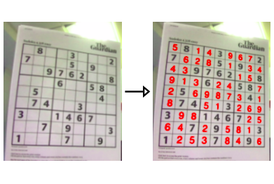

# Augmented Reality based Sudoku-Solver using OpenCV, PyTorch.

<p align="center">

</p>

## Project Pipeline
From reading the image to showing the solved sudoku back on the image, there are various tasks involved working in a pipeline.

1. Load Input Image

2. Locate where in the input image the puzzle is and extract the board using **image filtering**, **corner detetction** and **perspective transform**.

3. Given the board, **locate each of the individual cells** of the Sudoku board (most standard Sudoku puzzles are a 9×9 grid, so we’ll need to localize each of these cells).

4. Determine if a digit exists in the cell, and if so, recognise it using the **CNN Model**.

5. **Apply a Sudoku puzzle solver**/checker algorithm to validate the puzzle and solve it.

6. After getting the solved puzzle, display the output result to the user using **inverse perspective transform**.

## Run Locally

Clone the Repo

```bash
git clone https://github.com/lavish619/AR-Sudoku-Solver-Pytorch-OpenCV.git
```
Change Directory
```bash
cd AR-Sudoku-Solver-Pytorch-OpenCV
```
Before running the project, install all the dependencies namely PyTorch, OpenCV, Numpy etc.  

Then run the main.py file
```bash
python main.py 
``` 
to see the output.

For running on your our image, mention the path of the image in the main.py file.

## Training the digit recognition model  | PyTorch  
Complete code is present in Sudoku Training.ipynb Notebook. 

**Weights and Biases** is used for model tracking while training which is an amazing tool for experimentation, visualization and improving models.

## References
* [OpenCV Sudoku Solver and OCR](https://www.pyimagesearch.com/2020/08/10/opencv-sudoku-solver-and-ocr/)

* [Sudoku Solver using Computer Vision and Deep Learning](https://aakashjhawar.medium.com/sudoku-solver-using-opencv-and-dl-part-1-490f08701179) 

* [Wights and Biases PyTorch Integration for Model training](https://docs.wandb.ai/guides/integrations/pytorch) 

And some other resources....
 
Feel free to raise an issue in case of any corrections.